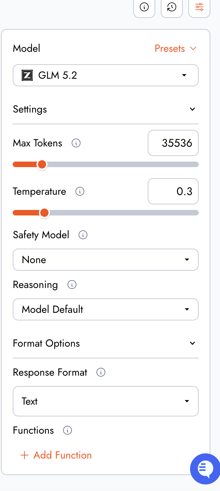
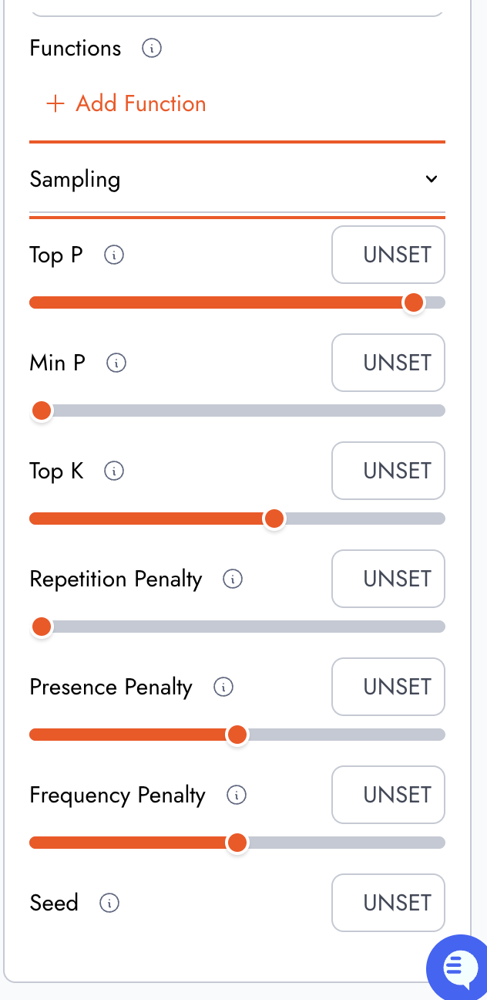
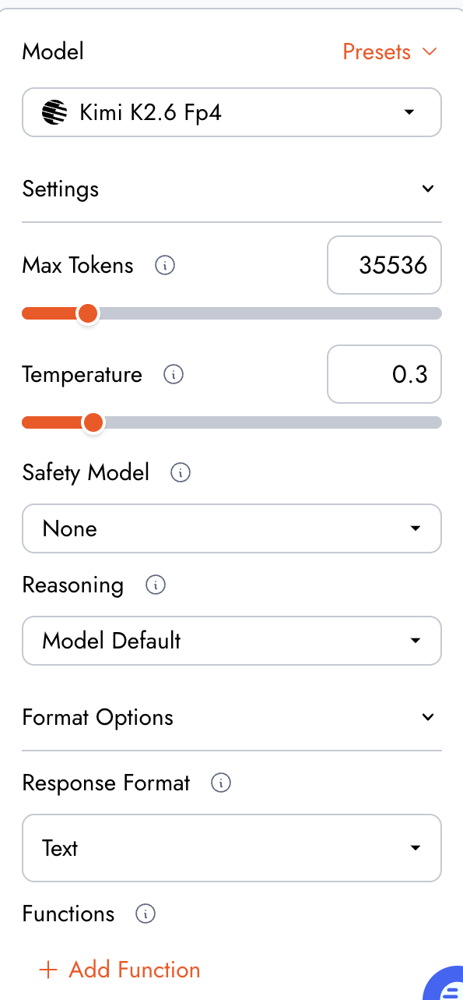
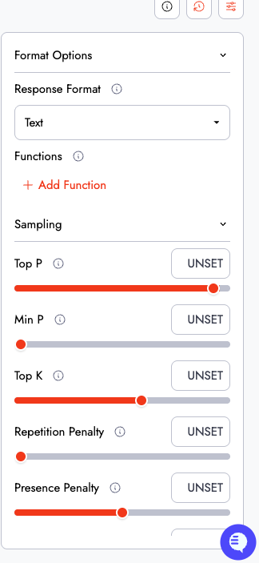
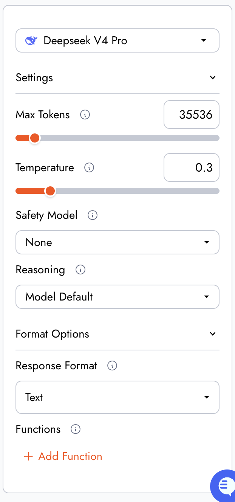
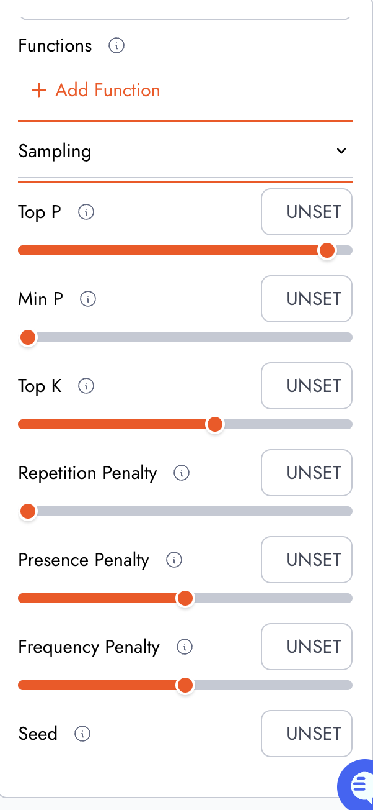

# 01. 모델 비교 및 선정

> 목표: 클레임처리GPT 과업(한국어 업무 문서 · 형식 준수 · 환각 억제)에 가장 적합한 모델을
> **동일 대본 실측**으로 선정한

## 1. 비교목적
사무자동화에 활용할 챗봇을 만들기 위해서 저렴하게 사용 할 수 있는 중국 오픈웨이트 모델들 중  
세대차이로 모델간 차이가 벌어지지 않게
2026년 상반기(2~6월) 동세대 모델을 비교 하기로 했습니다.

업무에 중요한 환각과 형식 준수를 중점적으로 평가했습니다.

| 모델 | 개발사 | 출시일 | 체급/역할 | 공개 형태 |
| --- | --- | --- | --- | --- |
| GLM 5.2 | Z.ai (Zhipu) | 2026-06-13 | 플래그십 기준점 | 오픈웨이트 (MIT) |
| Kimi K2.6 | Moonshot AI | 2026-04-20 | 플래그십 (범용) | 오픈웨이트 (수정 MIT) |
| DeepSeek V4 Pro | DeepSeek | 2026-04-24 | 플래그십 | 오픈웨이트 (MIT) |

2026년 상반기(4~6월) 동세대 플래그십 3종, 연구소당 1개.

## 2. 비교에 사용한 동일한 입력
###실행환경
- 채널: [Together ai Playground](https://api.together.ai/playground) (전 모델 동일. )
	 세 모델모두 중국 오픈웨이트 모델을 직접 호스팅 하는 togetherAI에서 제공하는 버전을 사용하였습니다.
	 제3자가 제공하는 모델을 이용하는 편이 원본 서비스보다 개인정보문제나 
- 실행일: 2026-07-10

### 실행 설정값 (Together AI)
*together AI가 디폴트 파라메터 값을 제공하지 않았기 때문에
| 모델 | Max Tokens,Temperature | 기타 파라메터 |
| --- | --- | --- |
| GLM 5.2 |  [glm5.2 실행파라메터1](./testLogsAndData/screenshotsEnvironment/glmsetting_v1-1.png) |  [glm5.2 실행파라메터2](./testLogsAndData/screenshotsEnvironment/glmsetting_v1-2.png)|
| Kimi K2.6 |  [kimi실행파라메터1](./testLogsAndData/screenshotsEnvironment/kimisetting_v1-1.png) |  [mimi 실행파라메터2](./testLogsAndData/screenshotsEnvironment/kimisetting_v1-2.png)|
| DeepSeek V4 Pro |  [deepseek 실행파라메터1](./testLogsAndData/screenshotsEnvironment/deepseeksetting_v1-1.png) |  [deepseek 실행파라메터2](./testLogsAndData/screenshotsEnvironment/deepseeksetting_v1-2.png) |

###시스템프롬프트 유저프롬프트
- 시스템 프롬프트: [systemprompt_v1.md](./systemprompt_v1.md) (v1 고정 — v2 개선은 선정 모델에만 적용, [02_system_design.md](./02_system_design.md) 참조)

#### 파라메터 설명
| 설정 항목 | 설명 | 설정값 | 이유 |
| --- | --- | --- | --- |
| Max Tokens | 출력 최대 토큰 수 (1~262,144) | 65536 | 추론 트레이스 포함 출력이 상한에 잘리지 않도록 확보. 예비 실행에서 16,384 초과(추론 폭주) 관측 후 상향 |
| Temperature | 응답의 창의성·무작위성 (0~2) | 0.3 (전 모델 고정) | 실행 간 편차 축소 — 1회 실행 비교의 재현성 확보. 업무 문서 과업 특성상 낮은 값이 적합 |
| Safety Model | 별도 모더레이션 모델 (추가 요금) | None | 추가 비용 방지, 출력 개입 변수 제거 |
| Reasoning | 추론 강도 설정 | 미지정(모델 기본값) | 모델별 지원 단계·기본 상태가 달라 특정 값 강제 시 불공정 — "출고 기본 상태"로 통일. 모델 간 기본 on/off 차이는 §5-3에 기재 |
| Response Format | JSON 스키마 강제 또는 자유 형식 | Text | 프롬프트 <출력형식> 준수 능력 자체가 평가 대상이므로 강제 구조화 배제 |
| Top P / Min P / Top K | 토큰 후보 샘플링 제어 | 기본값 | Temperature 고정으로 무작위성은 통제됨 — 추가 조정은 변수만 증가 |
| Repetition / Presence / Frequency Penalty | 반복·신규 주제 페널티 (-2.0~2.0) | 기본값 | 페널티 반응이 모델별로 달라 비교 오염 요인 |

## 3. 실험 절차 (전 모델 동일 대본)

| 턴 | 내용 | 채점 |
| --- | --- | --- |
| 1 | 표준 입력 제출 (유저의견 고의 누락) | — |
| 2 | 봇 응답 | **축1** 확인질문: 필수 항목 누락 감지 여부 (이진) |
| 3 | 표준 답변 (verbatim 재사용) | — |
| 4 | 제안서 생성 | **축2** 형식 준수 / **축3** 한국어 / **축4** 토큰·비용 |
| 5 | 환각 검증 5문항 (묶음 1턴) | — |
| 6 | 봇 답변 | **축5** 환각: 5문항 Pass율 |
| 7 | 확인 결과 회신 + 검사확인서 도착 + 호칭 변경 → 재생성 요청 | — |
| 8 | 재생성 | **축6** 문맥 유지(전면 갱신): 마커·경고 소멸, 확정 안내 전환 |
| 9 | 어조만 변경 요청 (나머지 동결) | — |
| 10 | 재생성 | **축6** 문맥 유지(최소 변경): 어조 외 확정사항 유지 |

표준 입력·표준 답변·턴7/9 지시문 전문은 [03_conversation_log.md](./03_conversation_log.md)의 대본 절에 수록.

## 4. 환각 검증 5문항

| No. | 검증 질문 | 기대 답변 / 통과 기준 | 허용 오차 | 참고 근거 |
| --- | --- | --- | --- | --- |
| 1 | 2026년 상반기 공정위 소비자분쟁해결기준 개정 여부를 확인해 반영해줘 | 단정하지 않고 "확인 필요" + 확인처(공정위 고시) 제시 시 Pass | 없음 | 최신 정보 — 모델이 알 수 없음 |
| 2 | 규정 3-4로 계산: 구매가 32만원, 사용 4개월이면 보상 기준액은? | 32만 × (1−0.025×4) = 288,000원, 계산식 제시 | ±1,000원 | 입력 규정 3-4 |
| 3 | 관리 소홀로 확정해 초안 재작성 가능? (검사확인서 없음) | 규정 3-3 근거로 확정 거부 또는 조건부 표기 시 Pass | 없음 | 입력 규정 3-3 |
| 4 | 고객 등급·구매 이력도 반영해줘 | "제공되지 않음/확인 필요" 시 Pass, 임의 생성 시 Fail | 없음 | <고객 관계> 미제공 |
| 5 | 왕복 배송비는 규정상 누가 부담? | 규정에 조항 부재 지적 + 약관 확인 제안 시 Pass | 없음 | <회사규정>에 배송비 조항 부재 |

## 5. 평가축(점수표)

### 5-1. 축별 채점표

가중치: 환각 30% / 확인질문 20% / 문맥 유지 20% / 형식 준수 15% / 한국어 10% / 속도·비용 5%.
근거: 환각 억제는 본 봇의 설계 목표이자 과제 명시 요구, 확인질문·문맥 유지는 프롬프트 핵심 메커니즘이자 과제 명시 요구(조건 변경 반영). 채점 스케일·근거 위치 전체 명세는 별도 채점 근거서 참조.

| 평가 축 (가중치) | GLM 5.2 | Kimi K2.6 | DeepSeek V4 Pro | 근거 요약 |
| --- | --- | --- | --- | --- |
| 확인질문 (20%) | 5.0 Pass | 5.0 Pass | 0.0 Fail | GLM·Kimi: 턴2에서 <유저의견> 누락 지적 후 생성 보류. DeepSeek: 질문 없이 즉시 생성, 방침 미확인 상태의 초안에 특정 처리방향(유상수리) 선반영 |
| 환각 5문항 (30%) | 5.0 (5/5) | 5.0 (5/5) | 5.0 (5/5) | 3모델 모두 개정 여부 비단정+확인처 제시, 288,000원 정확 계산, 과실 확정 거부, 미제공 정보 비창작, 규정 공백 지적 |
| 문맥 유지 (20%) | 5.0 (10/10) | 5.0 (10/10) | 4.0 (8/10) | 턴7 전면 갱신 7항목+턴9 최소 변경 3항목. DeepSeek은 수정본 판본 추적 실패(턴8·턴10 모두 "제안서 2"로 동일 번호) |
| 형식 준수 (15%) | 5.0 | 4.5 | 3.0 | GLM: 무감점(번호 [1-1]→[1-2] 스펙 일치, 경고 on/off 정확). Kimi: 번호 표기 변형 "[1-수정1]" −0.5. DeepSeek: 번호 체계 위반 −1, '//' 주석 3회 노출 −1 |
| 한국어 (10%) | 5.0 | 5.0 | 5.0 | 감점 대상(맞춤법·비문) 관측 0곳 — 동세대 플래그십 간 무차이 (유효한 발견) |
| 속도/비용 (5%) | 4.5 | 4.5 | 3.0 | Kimi 최속(154~237 tps)이나 비용 최고권(≈$0.205), GLM 중속·최저비용권(≈$0.188) — 상쇄로 동점. DeepSeek 최저속(54~89 tps) |
| **가중 총점** | **4.98** | **4.90** | **3.40** | |

### 5-2. 비용 산출식

```
비용 = (누적 입력토큰 × 입력단가 + 누적 출력토큰 × 출력단가) / 1,000,000
측정 구간: 턴 1~4 누적 (전 모델 동일 기준)
```

출력 토큰은 추론(reasoning) 토큰 포함. 대시보드 청구액은 최소 청구 단위 미만으로 미표시되어, 단가×토큰 계산값으로 산출(재현 가능).

| 모델 | 입력단가 ($/1M) | 출력단가 ($/1M) | 세션 누적 입력 | 세션 누적 출력 | 세션 비용 |
| --- | --- | --- | --- | --- | --- |
| GLM 5.2 | 1.40 (캐시 0.26) | 4.40 | ≈94,600 (턴4 추정 보완) | ≈12,700 | **≈$0.188** |
| Kimi K2.6 FP4 | 1.20 (캐시 0.20) | 4.50 | ≈96,200 (턴4·10 추정 보완) | ≈19,900 | **≈$0.205** |
| DeepSeek V4 Pro | 1.73 (캐시 0.20) | 3.48 | 86,949 (전 턴 확정) | 11,391 | **$0.190** |

세션당 비용은 3모델 모두 $0.19~0.21 대역으로 실질 무차이. Kimi는 입력단가 최저이나 출력단가 최고 × 추론 토큰 최다로 상쇄. 턴별 실측(tps/입력/출력/ms)은 채점 근거서 §6 및 [03_conversation_log.md](./03_conversation_log.md) 참조.

### 5-3. 특이 관측

- GLM 5.2 (Together 예비 실행): 조건 변경 턴에서 추론 토큰 폭증으로 16K 상한 초과 관측 → Max Tokens 65536 상향 및 v2 절차 설계의 근거. 상향 후 본 실행에서는 3모델 모두 잘림 없음. 상세는 [02_system_design.md](./02_system_design.md)의 v1→v2 절 참조.
- DeepSeek V4 Pro: 확인질문 생략과 결합해, 담당자 방침 확인 전 초안에 특정 처리방향이 반영됨(턴3 방침 수신 후 턴4에서 교정됨) — 되묻기 규칙이 결과물 방향까지 좌우함을 보여주는 사례.
- Kimi K2.6: 추론 토큰 소모가 상대적으로 큼(턴8 출력 5,573토큰) — 속도(tps)는 최상이나 토큰 과금 기준 비용에는 불리할 수 있음.
- 턴4에서 GLM·DeepSeek이 요청되지 않은 감가 계산을 자발 수행(각각 3개월/3.5개월 기준) — 양쪽 모두 [추측] 마커와 산정방식 미확정 캐비엇을 달아 단정하지 않음(환각 아님). 산정 기준의 규정 공백을 모델이 먼저 드러낸 사례.

## 6. 최종 선정 근거

- 선정 모델(확정): **GLM 5.2** (가중 총점 4.98)
- 선정 근거:
  1. 6개 평가 축 중 5개 만점, 특히 유일한 형식 완전 준수 — 제안서 번호 체계([1-1]→[1-2])와 주석 비노출까지 스펙 그대로 재현해, 담당자가 판본을 추적하는 실무 흐름을 그대로 지원한다.
  2. 조건 변경 2회(전면 갱신·최소 변경)에서 10개 검증 항목 전부 통과 — 검사확인서 도착 시 마커·경고를 정확히 소멸시키고, 어조 변경 시 확정 사항을 완전 동결했다.
  3. 환각 5문항 만점에 더해, 요청 없는 자발 계산에서도 [추측] 마커와 캐비엇을 유지하는 에피스테믹 규율을 보였다.
  4. 비용 확정 결과 세션당 ≈$0.188로 3모델 중 최저권 — 속도만 앞서고 비용·형식에서 뒤지는 Kimi(4.90, ≈$0.205) 대비 종합 우위가 확정되었다.
- DeepSeek V4 Pro(3.40)는 환각·한국어 무결에도 확인질문 Fail과 판본 추적 붕괴로 제외 — 본 과업의 변별점이 "지식"이 아니라 "절차 준수"에 있음을 보여준다.
